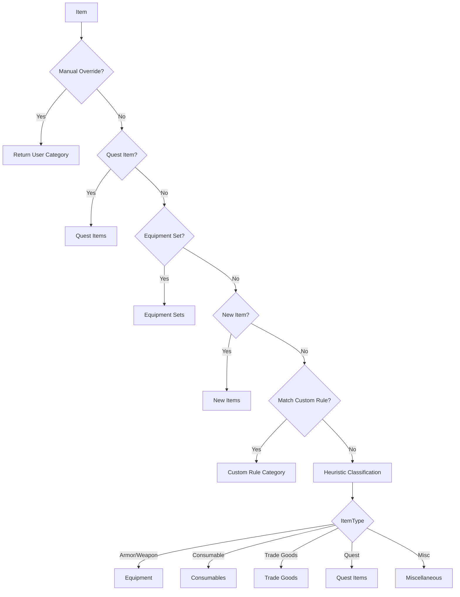

# Feature: Smart Categorization Engine

## Purpose

The Categorizer automatically assigns items to logical categories (Quest, Equipment, Consumables, Trade Goods, etc.) using a priority-based pipeline. This enables AdiBags-style sectioned views without manual user configuration.

## Related

- ADR: (pending)
- Code: `Omni/Categorizer.lua`

---

## Business Rules

1. Every item MUST be assigned exactly one category
2. Categories follow a strict priority pipeline (first match wins)
3. User manual overrides take highest priority
4. Categories are extensible (users can add custom categories)
5. Default categories provide "Smart Defaults" out of the box

---

## Category Priority Pipeline



---

## Default Categories

| Priority | Category | Detection Method |
|----------|----------|------------------|
| 1 | Manual Override | SavedVariables lookup |
| 2 | Quest Items | `GetContainerItemQuestInfo()` |
| 3 | Equipment Sets | `GetEquipmentSetItemIDs()` |
| 4 | New Items | Session snapshot comparison |
| 5 | Custom Rules | User-defined rule evaluation |
| 10 | Equipment | ItemType == "Armor" or "Weapon" |
| 11 | Consumables | ItemType == "Consumable" |
| 12 | Trade Goods | ItemType == "Trade Goods" |
| 13 | Reagents | ItemSubType == "Reagent" |
| 14 | Junk | Quality == 0 (Poor/Grey) |
| 99 | Miscellaneous | Fallback for unmatched items |

---

## API Reference

### Categorizer:Init()
Initialize the categorizer, load user overrides from SavedVariables.

### Categorizer:GetCategory(itemInfo) → string
Returns the category name for an item.

**Parameters:**
- `itemInfo` — Table from `OmniC_Container.GetContainerItemInfo()`

**Returns:**
- `categoryName` — String like "Quest Items", "Equipment", etc.

### Categorizer:SetManualOverride(itemID, categoryName)
Assign an item to a specific category (persisted).

### Categorizer:ClearManualOverride(itemID)
Remove manual override, revert to automatic.

### Categorizer:GetAllCategories() → table
Returns list of all category definitions with priorities.

### Categorizer:RegisterCategory(name, priority, filterFunc)
Register a custom category with filter function.

---

## Data Structures

### Category Definition
```lua
{
    name = "Quest Items",
    priority = 2,
    icon = "Interface\\QuestFrame\\UI-QuestLog-BookIcon",
    color = { r = 1, g = 0.82, b = 0 },
    filter = function(itemInfo) return itemInfo.isQuestItem end,
}
```

### Manual Overrides (SavedVariables)
```lua
OmniInventoryDB.categoryOverrides = {
    [12345] = "My Tank Set",  -- itemID → category name
    [67890] = "Profession",
}
```

---

## Test Flows

### Positive Flow: Quest Item Detection

**Precondition:** Character has a quest item in bags

1. Get item info via `OmniC_Container.GetContainerItemInfo()`
2. Call `Categorizer:GetCategory(itemInfo)`
3. Verify returns "Quest Items"

**Expected:** Quest items correctly categorized

### Positive Flow: Manual Override

**Precondition:** User has set manual override for itemID 12345

1. Get item info for itemID 12345
2. Call `Categorizer:GetCategory(itemInfo)`
3. Verify returns the user-assigned category

**Expected:** Manual override takes priority

### Negative Flow: Unknown Item

**Precondition:** Item has no matching rules

1. Get item info for misc item
2. Call `Categorizer:GetCategory(itemInfo)`
3. Verify returns "Miscellaneous"

**Expected:** Fallback category used

### Edge Case: Equipment Set Item

**Precondition:** Item belongs to saved equipment set

1. Get item info
2. Call `Categorizer:GetCategory(itemInfo)`
3. Verify returns "Equipment Sets"

**Expected:** Equipment set detection works

---

## Definition of Done

- [ ] `Omni/Categorizer.lua` implements priority pipeline
- [ ] Quest Items detected via API
- [ ] Manual overrides persist in SavedVariables
- [ ] Heuristic fallback for unknown items
- [ ] All test flows verified in-game
- [ ] ADR documented (if needed)
